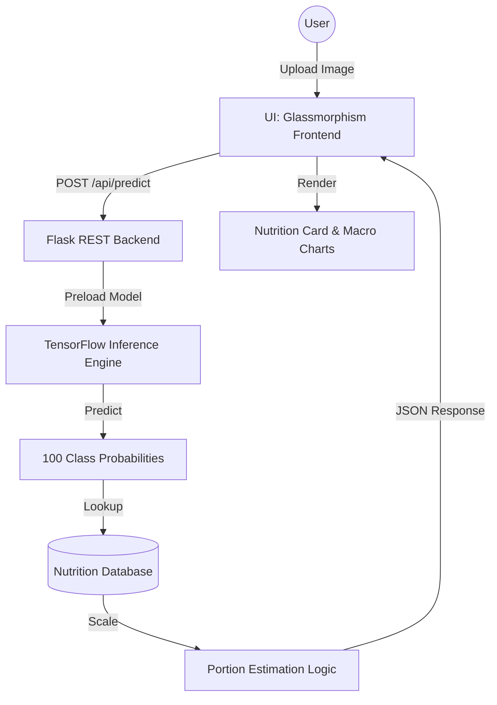
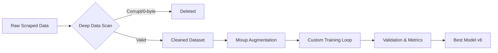

# 🥘 FoodSight AI: Advanced Project Overview & Tech Stack Journey

## 📌 Executive Introduction
FoodSight AI is a high-performance, multidisciplinary system designed to bridge the gap between computer vision and nutritional science. Developed by a team of CSE and VLSI 1st year students, it has evolved from a simple 8-class prototype into a robust 100-class production-ready platform.

---

## 🛠️ Unified Technology Stack

### 🧠 Deep Learning Engine
*   **Model**: MobileNetV3Large (optimized for alpha=1.0)
*   **Parameters**: ~3.09 Million (Lightweight yet expressive)
*   **Optimization Techniques**:
    - **Gradient Accumulation**: Simulated 4x effective batch size (14 → 56) to stabilize training on restricted GPU memory (15GB VRAM).
    - **Mixup Augmentation**: Linearly combined pairs of training examples to improve generalization across 100 classes.
    - **Label Smoothing (0.1)**: Prevented over-confident predictions and improved model calibration.
    - **Fine-Tuning**: Targeted unfreezing of the top 30 layers with a residual learning rate of 1e-5.

### 🌐 System Architecture

### 🔐 Infrastructure & Security
*   **Authentication**: Flask-Login session management with Bcrypt-hashed password storage.
*   **History Persistence**: User-specific SQLite logging (`instance/users.db`) with a zero-photo-retention privacy policy.
*   **Hardening**: 
    - **MIME-type Validation**: Magic byte checking for secure file uploads.
    - **Flask-Limiter**: Throttling prediction endpoints to prevent DoS attacks.

---

## 🚀 The Development Evolution

### 📊 Metric Comparison Table

| Review | Scope | Classes | Architecture | Target Accuracy | Final Accuracy | Key Innovation |
| :--- | :--- | :--- | :--- | :--- | :--- | :--- |
| **Review 2** | Foundation | 8 | MobileNetV2 | 80% | 86.34% | Transfer Learning Baseline |
| **Review 3** | Integration | 45 | MobileNetV2 | 85% | 89.10% | Flask Web App + Nutrition Data |
| **Review 4** | Robustness | 100 | MobileNetV3L | 85% | 85.21%* | Gradient Accumulation & History |

*\*Note: 85.21% on 100 classes represents a significant increase in complexity over 89.10% on 45 classes.*

---

## 🛠️ Data Engineering & Pipeline
The team implemented a custom pre-training pipeline to handle real-world data noise.

---

## 🔌 VLSI & Hardware Acceleration (Moushikka's Perspective)
A core component of our multidisciplinary approach is the path toward **Hardware AI**.

*   **FPGA Strategy**: Development of a custom RTL accelerator for MobileNetV3's `Depthwise Separable Convolutions`.
*   **Quantization**: Transitioning weight tensors from `float32` to `int8` (Post-Training Quantization) to fit within the limited BRAM of Xilinx FPGAs.
*   **Performance Goal**: Achieving microsecond-level inference on edge hardware without reliance on cloud-based GPUs.

---

## 🥗 Nutrition Intelligence & Logic
The system doesn't just predict a name; it calculates health indicators in real-time.

1.  **Macro-Nutrient Visualization**: SVG-based circular charts with staggered 200ms entry animations.
2.  **Portion Multipliers**: 
    - Small (0.5x), Medium (1.0x), Large (1.5x), Family (2.0x).
3.  **Health Badges**:
    - **Diabetic Friendly**: Automatically tagged if Sugar < 10g and Fiber ≥ 3g.
    - **Heart Healthy**: Filtered for Sodium < 400mg.
    - **High Protein**: Triggered at ≥ 15g per serving.

---

## 🚧 Critical Challenges & Engineering Solutions
*   **The "OOM" Wall**: Resolved via custom loops using `gc.collect()` and gradient accumulation to simulate large batches on consumer-grade cloud GPUs.
*   **Windows TF Compatibility**: Addressed through specific versioning (TensorFlow 2.15+) and optimized preprocessing pipelines to ensure stability on local development environments.
*   **Data Corruption**: Built `audit_script.py` to decode and verify every single pixel of the 148,000-image training set before execution.

---

## 🍽️ Supported Food Classes (100)
The model is trained to recognize a comprehensive variety of Indian dishes across all major regions.

| Category | Dishes |
| :--- | :--- |
| **Breakfast** | Aloo Paratha, Amritsari Kulcha, Appam, Dhokla, Idiyappam, Idli, Masala Dosa, Medu Vada, Methi Thepla, Poha, Pongal, Puttu, Set Dosa, Upma, Uttapam, Vada Pav, etc. |
| **Main Course** | Aloo Gobi, Aloo Mutter, Aviyal, Bhindi Masala, Biryani, Bisi Bele Bath, Butter Naan, Chana Masala, Chapati, Chicken Chettinad, Chilli Chicken, Chole Bhature, Curd Rice, Dal Khichdi, Dal Makhani, Egg Curry, Fish Curry, Fish Fry, Fried Rice, Garlic Naan, Kadai Paneer, Kerala Fish Curry, Kothu Parotta, Lemon Rice, Litti Chokha, Macher Jhol, Manchurian, Navratan Korma, Palak Paneer, Paneer Masala, Puri Bhaji, Rajma Chawal, Rava Dosa, Sambar Rice, Kaathi Rolls, Seekh Kebab, Tamarind Rice, Thali, Thukpa. |
| **Street Food** | Burger, Chicken 65, Chivda, Dabeli, Masala Papad, Misal Pav, Momos, Paani Puri, Pakora, Papdi Chaat, Pav Bhaji, Samosa, Sev Puri. |
| **Dessert** | Balushahi, Falooda, Gajar Ka Halwa, Ghevar, Gujhia, Gulab Jamun, Jalebi, Kaju Katli, Kheer, Kulfi, Laddu, Modak, Moong Dal Halwa, Mysore Pak, Payasam, Phirni, Puran Poli, Rasgulla, Sandesh, Unni Appam. |
| **Beverages** | Chaas, Chai, Rasam. |

**Full Alphabetical List**:
*Aloo Gobi, Aloo Mutter, Aloo Paratha, Amritsari Kulcha, Appam, Aviyal, Balushahi, Bhindi Masala, Biryani, Bisi Bele Bath, Burger, Butter Naan, Chaas, Chai, Chana Masala, Chapati, Chicken 65, Chicken Chettinad, Chicken Wings, Chilli Chicken, Chivda, Chole Bhature, Curd Rice, Dabeli, Dal Khichdi, Dal Makhani, Dhokla, Egg Curry, Falooda, Fish Curry, Fish Fry, Fried Rice, Gajar Ka Halwa, Garlic Bread, Garlic Naan, Ghevar, Grilled Sandwich, Gujhia, Gulab Jamun, Hara Bhara Kebab, Idiyappam, Idli, Jalebi, Kaathi Rolls, Kadai Paneer, Kaju Katli, Karimeen Pollichathu, Kerala Fish Curry, Kheer, Kothu Parotta, Kulfi, Laddu, Lemon Rice, Litti Chokha, Macher Jhol, Manchurian, Masala Dosa, Masala Papad, Medu Vada, Methi Thepla, Misal Pav, Modak, Momos, Moong Dal Halwa, Mysore Pak, Navratan Korma, Paani Puri, Pakora, Palak Paneer, Paneer Masala, Paniyaram, Papdi Chaat, Pav Bhaji, Payasam, Phirni, Pizza, Poha, Pongal, Puran Poli, Puri Bhaji, Puttu, Rajma Chawal, Rasam, Rasgulla, Rava Dosa, Sabudana Khichdi, Sabudana Vada, Sambar Rice, Samosa, Sandesh, Seekh Kebab, Set Dosa, Sev Puri, Tamarind Rice, Thali, Thukpa, Unni Appam, Upma, Uttapam, Vada Pav.*

---
**Current Status**: ✅ Production Ready | **Next Milestone**: Native Mobile App 
